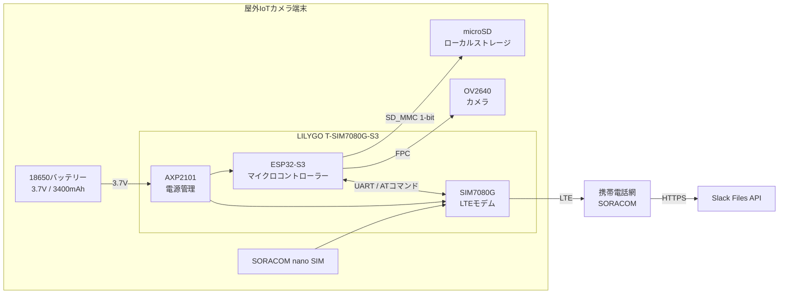

# 屋外IoTカメラ 現時点の仕様

## システム構成

| 区分 | 採用仕様 |
|---|---|
| 制御・通信ボード | LILYGO T-SIM7080G-S3（ESP32-S3 + SIM7080G） |
| カメラ | OV2640、200万画素、広角160度、24ピンFPC |
| ローカル保存 | microSD、SD_MMC 1-bitモード |
| モバイル通信 | SORACOM nano SIM、plan-D候補、LTE |
| 通知先 | Slack Files API（Slack AppのBotとして送信） |
| 電源 | 1セル 3.7V、Panasonic NCR18650B 3400mAh（保護回路なし） |
| 省電力 | ESP32 DeepSleepを第一段階として採用 |
| 将来拡張 | GPS位置情報、MOSFET/TPL5110による電源遮断、ソーラー充電 |

## システム構成図

この図はハードウェア、通信網、外部サービスの構成と接続関係のみを表す。撮影、保存、通知、DeepSleepなどの機能的な処理順序は次節に記載する。

## 基本動作

1. タイマーで起動する。
2. OV2640でJPEG静止画を1枚撮影する。
3. JPEGをmicroSDへ保存する。
4. LTE接続を確立する。
5. 端末識別情報と画像をSlackへ通知する。
6. 24時間後を次回起動時刻として設定する。
7. DeepSleepへ移行する。

Slack送信またはLTE接続に失敗しても、保存済み画像は削除しない。

## Slack連携

- 画像ファイルの送信には、Slack Files APIの利用を許可したSlack Appを使用する。
- Slack AppのBot Token Scopesへ `files:write` を付与し、ワークスペースへインストールして発行されたBotトークン（`xoxb-`）を端末から利用する。
- 送信先にはチャンネル名ではなくチャンネルIDを使用し、Botを対象チャンネルへ参加させる。
- ファイルアップロードは、`files.getUploadURLExternal` でアップロード先とfile IDを取得し、返されたURLへJPEGを送信した後、`files.completeUploadExternal` で対象チャンネルへの共有を確定する。
- 廃止済みの `files.upload` は使用しない。
- Botトークン、Wi-Fiパスワード、SIM/APN認証情報はGit管理外の `secrets.h` などに保存する。
- `secrets.example.h` を用意する場合はキー名のみを記載し、実値を含めない。
- 認証情報をシリアルログへ出力せず、Authorizationヘッダーや完全なリクエスト内容もログへ残さない。

Slack Files API:

- https://docs.slack.dev/reference/scopes/files.write/
- https://docs.slack.dev/reference/methods/files.getUploadURLExternal/
- https://docs.slack.dev/reference/methods/files.completeUploadExternal/

## 確認済みのハードウェア設定

### Arduino IDE

- Board: `ESP32S3 Dev Module`（`LILYGO ESP32S3 Dev Module`でも可と記録）
- USB CDC On Boot: `Enabled`
- Serial baud rate: `115200`
- PSRAM: `OPI PSRAM`
- PSRAM実測認識容量: 8,388,608 bytes

### PMU (AXP2101)

| 出力 | 電圧 | 用途/状態 |
|---|---:|---|
| ALDO1 | 1.8V | カメラ用に有効化 |
| ALDO2 | 2.8V | カメラ用に有効化 |
| ALDO3 | 3.3V | microSD用に有効化 |
| ALDO4 | 3.0V | カメラ用に有効化 |

I2CはSDA GPIO 15、SCL GPIO 7を使用する。

### microSD

| 信号 | GPIO |
|---|---:|
| CLK | 38 |
| CMD | 39 |
| DATA | 40 |

`SD_MMC.begin("/sdcard", true)` により1-bitモードでマウントする。動作確認に使用したカードは約1,876MBとして認識された。

### OV2640カメラ

| 信号 | GPIO | 信号 | GPIO |
|---|---:|---|---:|
| RESET | 18 | PWDN | -1（未使用） |
| XCLK | 8 | PCLK | 12 |
| SIOD | 2 | SIOC | 1 |
| VSYNC | 16 | HREF | 17 |
| Y2 | 14 | Y3 | 47 |
| Y4 | 48 | Y5 | 21 |
| Y6 | 13 | Y7 | 11 |
| Y8 | 10 | Y9 | 9 |

- XCLK: 20MHz
- Pixel format: JPEG
- 初期設定: UXGA、JPEG quality 10
- 動作確認時: QVGA（320×240）へ変更
- Frame buffer: PSRAM、PSRAM認識時は2面
- Grab mode: `CAMERA_GRAB_LATEST`

## 未確定事項

- SIM/APN設定とLTE接続手順
- Slack Files APIのタイムアウト、再試行回数、レート制限時の待機方針
- 画像ファイル名、保存期間、ローテーション方法
- 正確な撮影時刻の取得方法
- バッテリー残量の取得・通知方法
- DeepSleepを含む一周期の消費電力量と想定稼働日数
- 防水・防塵、結露、温度対策を含む筐体仕様
