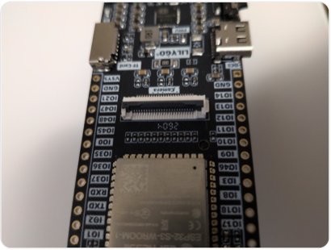
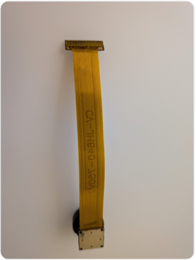
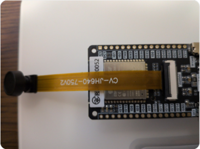
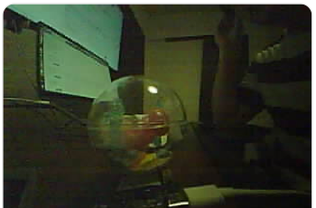

# Step 4: OV2640撮影・microSD保存

状態: **完了**

## 目的

OV2640を接続してJPEGを1枚撮影し、microSDへ保存する。

## 接続

1. ボードの `Camera` と記載された白黒のFPCコネクタの黒いラッチを約90度起こす。
2. カメラ基板側をボードへ向け、FPCを奥まで差し込む。
3. ラッチを閉じる。少し固いため、FPCが斜めになっていないことを確認する。
4. レンズ先端の保護キャップを外す。







## Arduino IDE設定

Tools → PSRAM → `OPI PSRAM` を選ぶ。確認時は8MB（8,388,608 bytes）のPSRAMを認識した。

## 実装上の要点

- AXP2101のALDO1=1.8V、ALDO2=2.8V、ALDO4=3.0Vでカメラへ給電する。
- microSDを同時使用するときはALDO3=3.3Vも有効にする。
- GPIO割り当ては [仕様書](../design/02_specification.md#ov2640カメラ) を参照する。
- `PIXFORMAT_JPEG`、20MHz XCLK、PSRAM上のframe bufferを使用する。
- 初期化後、確認用にフレームサイズをQVGAへ変更する。
- `esp_camera_fb_get()` のバッファを `File::write()` で保存し、最後に必ず `esp_camera_fb_return()` する。

保存処理の中心部分:

```cpp
camera_fb_t *fb = esp_camera_fb_get();
if (!fb) {
  Serial.println("Capture FAILED");
  return;
}

File file = SD_MMC.open("/esp_32_photo.jpg", FILE_WRITE);
if (file) {
  size_t written = file.write(fb->buf, fb->len);
  file.close();
  Serial.printf("Saved %u bytes\n", written);
}
esp_camera_fb_return(fb);
```

## 結果

- 撮影サイズ: 320×240
- JPEGサイズ: 約4KB（確認ログでは4,070 bytes）
- microSDへの保存に成功
- 暗所で撮影できたが、画質には改善の余地がある



(ログでは保存先を `/esp_32_photo.jpg` としながら表示メッセージが `/photo.jpg` になっていたため、今後は表記を統一する。)
